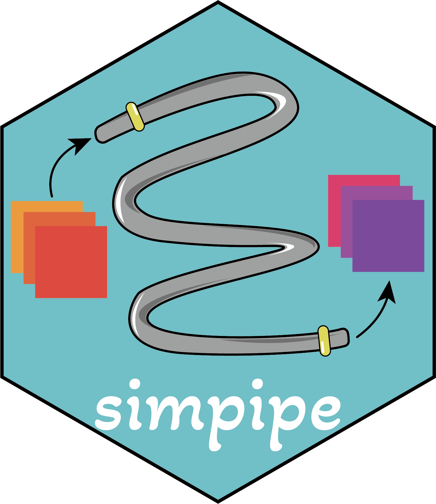

# Simpipe provides the standard pipeline of estimating parameters from read data, simulating and evaluating simulated data.

The goal of simpipe is to establish a standard pipeline to estimating
parameters from real datasets, simulating single-cell RNA-seq datasets
and evaluating the simulated data from general and functional
perspectives.

## Installation

You can install the development version of simpipe from
[GitHub](https://github.com/) with:

``` r
# install.packages("devtools")
devtools::install_github("duohongrui/simmethods")
devtools::install_github("duohongrui/simpipe")
```

if you want to use simpipe to simulate datasets with **trajectory
information**, please install **tislingshot** first by:

``` r
# install.packages("devtools")
devtools::install_github("dynverse/ti_slingshot/package/")
```

## Usage

The documentation of simpipe is availabel at our
[Simsite](http://www.ciblab.net/software/Simsite/). In addition, you can
also learn the usage of every simulation methods we have collected.

Users can also download our simpipe [Docker
Image](https://hub.docker.com/repository/docker/duohongrui/simpipe/general)
and use
[**simpipe2docker**](https://github.com/duohongrui/simpipe2docker)
package for linking R environmrnt and the Docker container. For more
details, please refer to
[Simsite](http://www.ciblab.net/software/Simsite/).

## Contact

If you have any question, please email to Hongrui Duo
(<duohongrui@cqnu.edu.cn>) or raise an issue for that.

## Citation

Duo H, Li Y, Lan Y, *et al*. Systematic evaluation with practical
guidelines for single-cell and spatially resolved transcriptomics data
simulation under multiple scenarios. ***Genome Biology***, 2024, 25(1):
145.
